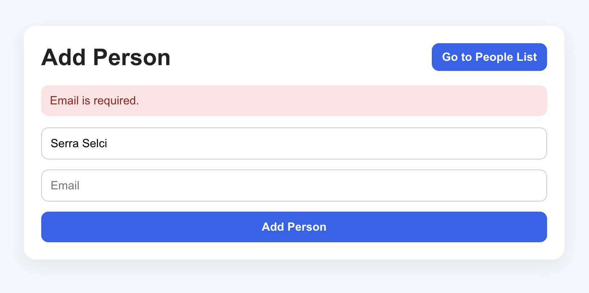
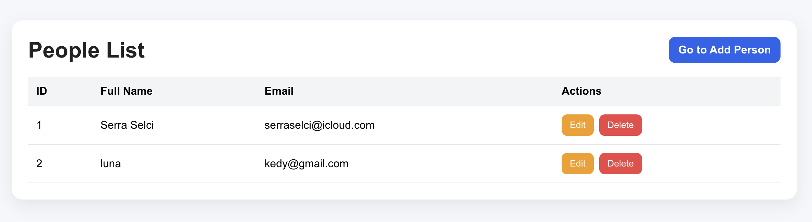
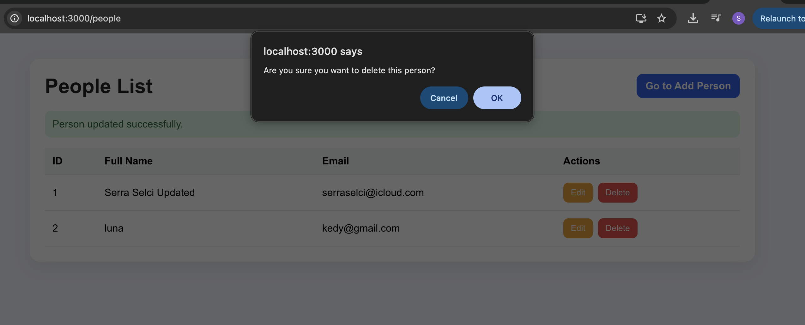
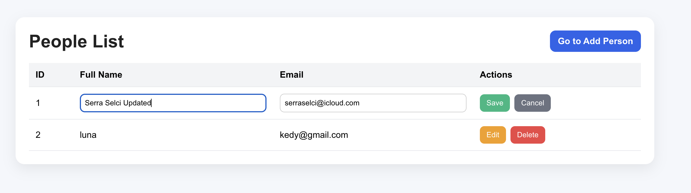

# Person Management System (SENG384 HW)

## Project Description
This is a full-stack web application developed for the SENG384 course[cite: 1, 3]. It allows users to manage person records through a web interface, with data persisted in a PostgreSQL database[cite: 12, 15]. The project is fully containerized using Docker and Docker Compose.

---

## Tech Stack
* Frontend: React 
* Backend: Node.js & Express 
* Database: PostgreSQL 
* Infrastructure: Docker & Docker Compose 

---

## Setup and Run Instructions

1. Prerequisites:
Ensure Docker and Docker Compose are installed on your machine.

2. Run the Application:
Open your terminal in the project root and run:
docker compose up --build 

3. Access the Application:
* Frontend (Add Person): http://localhost:3000 
* People List Page: http://localhost:3000/people 
* Backend API: http://localhost:5001/api 

---

## API Documentation (Base Path: /api)

* GET /api/people - Retrieve all registered people 
* GET /api/people/:id - Retrieve a single person by ID 
* POST /api/people - Register a new person 
* PUT /api/people/:id - Update an existing person's details 
* DELETE /api/people/:id - Remove a person from the database

---

## Key Features
* Full CRUD Functionality: Create, Read, Update, and Delete operations.
* Validation: Client-side (regex) and server-side validation for email formats.
* Automated Setup: The database schema is initialized automatically upon startup.
* Proper Status Codes: Returns 200, 201, 400, 404, 409, or 500 based on the operation result.

---

## Environment Variables
The application uses the following variables for database configuration:
DB_HOST, DB_PORT, DB_USER, DB_PASSWORD, DB_NAME

---

## Screenshots
### Registration Form

### People List

### CRUD Operations (Edit/Delete)

